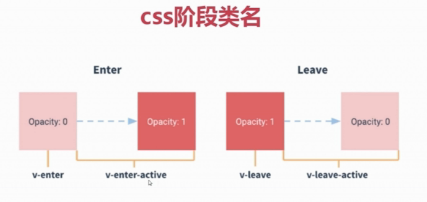

#### 一、过渡/动画

#####**接收过渡的：v-show    v-if(v-else)   动态组件这三种模式**

引入transition内置组件，应用在想要动画效果的标签上

```js
//渐隐 ： 文字会柔和的消失
<transition name = "fade">
	<p v-show="show">i am a show</p>    
</transition>
```

transition组件不同阶段给元素赋予不同的类名，通过CSS控制不同阶段的类名：



```css
<style>
.fade-enter-active, .fade-leave-active {
    transition: opacity .5s easy-out;
}
//主要决定怎么变的两个阶段
.fade-enter, .fade-leave-active {
    //transform: translateY(-500px);
    opacity: 0;
}
</style>
```

#####动态组件

```js
<button v-on:click="toggleCom">Toggle</button>
<!--mode控制动画展示的过程-->
<transition name = "fade" mode="out-in">
	<div :is="currentView"></div>    
</transition>

export default{
    data (){
        return {
            currerentView : 'com-a'
        }
    }
    methods:{
        toggleCom (){
    		if(this.currerentView === 'com-a'){
    			this.currerentView = 'com-b'
			}else{
    			this.currerentView = 'com-a'
			}
        }
    }
}

```

注意：标签名相同的两个元素必须制定key,否则会没有动画效果

```js
<p v-if="show" key="1">i am show</p>
<p v-else key="2">not show</p>
```

